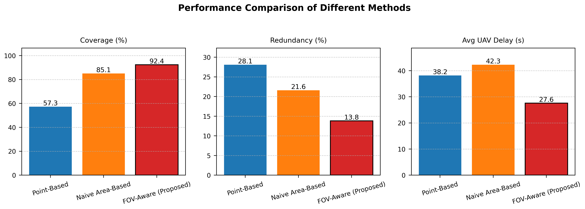

# FOV-Aware UAV–UGV Area Coverage with Battery Constraints

Code for the ICUAS 2025 paper:

> **Team Orienteering and Scheduling Algorithms for Collaborative UAV-UGV Area Coverage with Battery Constraints**
> Jaekyung Jackie Lee, Sivakumar Rathinam — *International Conference on Unmanned Aircraft Systems (ICUAS), 2025*
> Texas A&M University



## Overview

A FOV-aware, area-based coordination framework for persistent UAV–UGV surveillance under limited battery capacity and road-constrained UGV mobility.

- The surveillance region is discretized into grid cells sized by the UAV camera footprint.
- A single UGV follows a fixed route extracted from GeoJSON road data and acts as a mobile charging station with two wireless pads.
- The task is formulated as a **Team Orienteering Problem (TOP)** and solved with a structured meta-heuristic:
  heading-aware path construction (±5° heading cone), tabu-search improvement, and dynamic reward re-initialization to escape local optima.
- UAV routes are synchronized with an **ILP-based charging scheduler** (Gurobi) that respects flight-time and charging constraints.

Simulations over the Texas A&M campus show up to **19% higher area coverage**, **11.3% less redundant coverage**, and lower charging delays than point-based and naive area-based baselines.

## Repository structure

```
TOP/                    Core TOP meta-heuristic
├── main.py             Entry point
├── config_settings.py  Vehicle, battery, and algorithm parameters
├── pipeline_manager.py Runs the pipeline stages in order
├── pipeline/           step_zero → step_one (construction) → step_two (improvement)
│                       → tabu_search → step_reinit → step_reattachment
├── models_vehicle.py   UAV model
├── reward_manager.py   Age-based node rewards
├── schedule_maxfly.py  ILP charging schedule
└── plot_*.py           Result plots
map/                    TAMU campus GeoJSON → grid conversion, coverage animation
UAV_UGV_Simulation/     UAV–UGV scheduling simulation
figs/                   Figures
paperfigure.py          Method-comparison figure
```

## Getting started

```bash
python3 -m venv .venv && source .venv/bin/activate
pip install -r requirements.txt
cd TOP && python main.py
```

Set `csv_path` in `TOP/config_settings.py` to your local scenario file before running.

## Status

Research code as used for the paper. A refactor (config handling, shared TOP core with related projects, tests) is in progress.

## Related work

- Persistent robot charging (IEEE RA-L 2025): [persistent-robot-charging](https://github.com/jkleecontrols/persistent-robot-charging)

## Citation

```bibtex
@inproceedings{lee2025icuas,
  title     = {Team Orienteering and Scheduling Algorithms for Collaborative {UAV-UGV} Area Coverage with Battery Constraints},
  author    = {Lee, Jaekyung Jackie and Rathinam, Sivakumar},
  booktitle = {International Conference on Unmanned Aircraft Systems (ICUAS)},
  year      = {2025}
}
```
